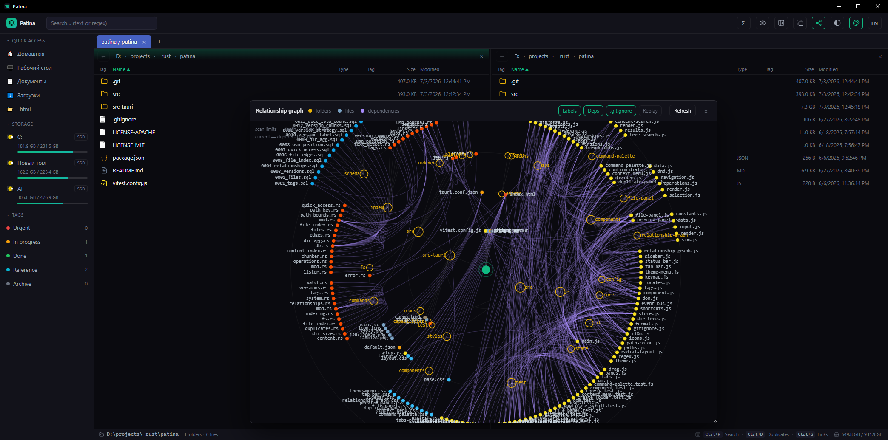

<div align="center">

# 🌿 Patina

**Experimental file manager**

`0.1` · Windows 10 · Rust + Tauri 2 · vanilla HTML/CSS/JS



</div>

---

## Why

Patina is an attempt to build a tool designed **around an index, not around a file list**: search, tags, a relationship graph, duplicate detection, and version history for any files, not just code.

---

## Features

### Navigation
- **Browser-style tabs** with state persistence and reopening of closed tabs (`Ctrl+Shift+T`).
- **Two panes** with independent navigation, breadcrumbs, and a draggable divider.
- **Virtualized list** — smooth performance on directories with tens of thousands of files.
- **Full keyboard navigation** — arrows, `Home`/`End`, `Enter` to open, `Backspace` to go up, `Shift+Arrow` to extend the selection (see [Hotkeys](#hotkeys)).
- **Right-click context menu** — open, show in Explorer, rename, tag, find duplicates, delete; the empty-area menu creates a folder.
- **Native file icons** (like in Explorer), loaded lazily and cached on disk.
- Columns: name, type, tags, size (including computed folder sizes), modified date.

### Search — command palette (`Ctrl+K`)
- Three search scopes: **current folder**, **whole subtree**, **file contents**.
- **Regular expression** mode.
- Tag filter (intersection, AND).

### Organization
- **Color-coded tags**: Urgent, In progress, Done, Reference, Archive.
- **Tag cloud** in the sidebar with counters.
- **Quick access** (Home, Desktop, Documents, Downloads) — editable.
- **Storage indicators**: volume labels, media type (SSD/HDD), used/total.

### Smart tools
- **Relationship graph** (`Ctrl+G`) — an interactive canvas graph of dependencies and back-references between files.
- **Duplicate finder** (`Ctrl+D`) — grouping by content hash (BLAKE3), with Keep/Delete actions.
- **Version history** — from the preview panel: snapshot any file, browse a timeline, restore, and delete versions; before a restore a safety copy of the current state is taken automatically.
- **Preview** — image thumbnails and text, plus a file info panel (metadata, tags, versions).

### File operations
- Copy, move, rename, create folders.
- **Drag-and-drop** — drag entries between panes or onto a folder to copy/move them.
- Delete **to the Recycle Bin** (native `IFileOperation` on Windows — UAC, long-path, and UNC-path support).
- Name-conflict detection with a confirmation dialog.
- Open in the default app and "Show in Explorer".

### Appearance and language
- **Themes** — three palettes, switchable from the title bar and remembered between sessions: Dark Emerald (default), Warm Gold, and Light Blue.
- **Interface localization** — English and Russian. The language is auto-detected on first launch (browser locale, Russian by default), can be switched in the UI, and is remembered.

### Live index
- Incremental sync via the **NTFS USN Journal** — no constant disk rescanning.
- Real-time change watching (`notify`).
- Background aggregation of folder sizes.

---

## Hotkeys

### Global
| Combo | Action |
|---|---|
| `Ctrl+K` | Search / command palette |
| `Ctrl+D` | Duplicate finder |
| `Ctrl+G` | Relationship graph |
| `Ctrl+T` | New tab |
| `Ctrl+W` | Close tab |
| `Ctrl+Shift+T` | Reopen closed tab |
| `Ctrl+Shift+N` | Create folder |
| `Delete` | Delete selection to the Recycle Bin |

### List navigation
| Key | Action |
|---|---|
| `↑` / `↓` | Move the selection |
| `Home` / `End` | Jump to the first / last entry |
| `Shift+↑` / `Shift+↓` | Extend the selection |
| `Enter` | Open the file or enter the folder |
| `Backspace` | Go up to the parent folder |
| `Escape` | Close the palette / menu / dialog |

---

## Technology

| Layer | Stack |
|---|---|
| Backend | Rust, Tauri 2 |
| Index | SQLite (rusqlite, WAL), 13 migrations |
| Hashing | BLAKE3 |
| Versions | content-addressed storage: full / zstd with a dictionary / chunked deduplication |
| Platform | WinAPI (`windows`): native icons, Recycle Bin, volumes, USN Journal |
| Frontend | vanilla HTML/CSS/JS, native ES modules (no bundler) |
| i18n | built-in dictionary (English, Russian), no runtime dependencies |
| Tests | Vitest (frontend) + `cargo test` (backend) |

Architecture: the frontend talks to the backend **only** through a thin layer of `invoke` wrappers (`src/js/api/`). State is a single observable store plus an event bus. The backend is split into layers: commands (IPC) → services (fs/index/indexer) → repositories → models; platform-specific code is isolated behind `cfg` flags.

Security: strict CSP, `freezePrototype`, disabled native drag-drop, minimal capabilities (`core:default`), no outbound network, and escaping of all data inserted into the DOM.

---

## Build and run

**Requires:** Rust ≥ 1.85 (edition 2024), Node.js (only for frontend tests), [Tauri system dependencies](https://tauri.app/start/prerequisites/).

```bash
# Run in development mode
cargo tauri dev

# Release build (installer)
cargo tauri build

# Frontend tests
npm install
npm test

# Backend tests
cd src-tauri && cargo test
```

---

## Project structure

```
patina/
├── src/                 # frontend (vanilla)
│   ├── index.html
│   ├── js/
│   │   ├── api/         # the only boundary with Tauri (invoke wrappers)
│   │   ├── core/        # store, event bus, base Component, shortcuts
│   │   ├── components/  # UI components
│   │   ├── state/       # state slices
│   │   ├── lib/         # helpers (format, virtualization, regex, icons, i18n, theme)
│   │   ├── config/      # tags, keymap, locale dictionaries
│   │   └── test/        # Vitest tests
│   └── styles/          # theme tokens + per-component CSS
└── src-tauri/           # backend (Rust)
    └── src/
        ├── commands/    # thin IPC command layer
        ├── fs/          # file operations
        ├── index/       # SQLite index, repositories, migrations
        ├── indexer/     # background workers (scan, USN, hashes, links)
        ├── platform/    # OS specifics (WinAPI)
        └── models/      # domain structs
```

---

## Status

**0.1 — early version.** The priority platform is Windows 10. Cross-platform code is partially in place, but it is not a goal of this release.

### Known limitations
- The "Cloud" storage type is not detected yet (shown as a plain "Disk").
- The duplicate finder and content index work over the subtree of the active root.
- Restoring a version overwrites the live file (the current state is saved to history beforehand).
- Interface localization covers English and Russian only.

---

## License

Dual-licensed under either of:

- Apache License, Version 2.0 ([LICENSE-APACHE](LICENSE-APACHE))
- MIT License ([LICENSE-MIT](LICENSE-MIT))

at your option.

Unless you explicitly state otherwise, any contribution intentionally submitted
for inclusion in this project, as defined in the Apache-2.0 license, shall be
dual-licensed as above, without any additional terms or conditions.
